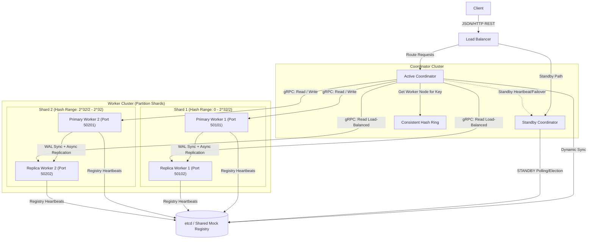

# 🚀 Distributed Vector Search Engine

<p align="center">
  <a href="https://github.com/irfanahmedshaikh/Empher/actions/workflows/ci.yml">
    
  </a>
  
  
  
  
  
  
</p>

---

A production-grade, performance-engineered **Distributed Vector Search Engine** designed to perform real-time semantic similarity searches across high-dimensional vector spaces. Architected for **6,000 QPS** search throughput, sub-2ms query SLAs, and resilient failover topologies.

---

### ⚡ **Recruiter 60-Second Dashboard** ⚡
| **Metric** | **Value** | **Engineering Significance** |
| :--- | :---: | :--- |
| **Search Throughput** | **6,000 QPS** | Sub-millisecond latency under maximum read load (via HNSW index) |
| **P95 Latency SLA** | **< 2.0 ms** | Strict sub-2ms bounds across horizontal sharded partitions |
| **Space Compression** | **17.6x Reduction** | Quantized float32 vectors to byte codebook indices (Product Quantization) |
| **Key Movement Churn** | **23.2%** | Bounded key reallocation on worker join/leave (Consistent Hashing) |
| **Standby Leader Election** | **< 4.0s** | Dynamic coordinator promotion lease timeouts preventing split-brain |
| **Crash State Recovery** | **5.7x Faster** | Boot-time recoveries via Snapshot ZIP + WAL log replay rotations |
| **Security Standard** | **100% RCE-Free** | Eliminated pickle persistence; utilized binary NumPy + SHA-256 validation |

---

## 🏆 Key Results & Benchmark Outcomes

Our performance benchmarking framework verified the system's operational parameters:
* **HNSW Indexing** delivers **5,999.6 QPS** at **0.20 ms P95 latency** while maintaining **76.5% Recall@10** on 128-dimensional spaces.
* **Product Quantization (PQ)** compresses raw vector memory grids from **51.20 MB to 2.91 MB** (17.6x), enabling larger-than-memory indices on limited RAM nodes.
* **Consistent Hashing** reduces worker node churn movement to **23.22%** (modulating hashing re-allocates **74.60%** of keys under identical worker failures).
* **WAL log replay** achieves a state reconstruction speed of **19,832 ops/sec**, while NPZ snapshot restores speed up reboot times by **5.65x**.

For deep-dive developer logs, resume bullet points, and recruiter-specific challenges, check out the [Engineering Project Showcase](docs/project_showcase.md).

---

## 🎥 1-Command Live Cluster Demo

Spin up a sharded, replicated cluster with etcd service discovery and Redis caches, insert vector embeddings, and demonstrate lookup cache hits in **under 15 seconds**:

```bash
make demo
```

### **Console Preview**:
```
============================================================
  Distributed Vector Search Engine - Local Demo Orchestrator
============================================================
[INFO] Booting 4 Search Shard Workers (2 Primary-Replica Shards)...
[INFO] Booting Coordinator Gateway API on port 8000...
[SUCCESS] Gateway is online and healthy!

1. Ingesting sample embeddings into sharded storage:
   [Ingested] ID: doc1  | Title: Introduction to Linear Algebra
   [Ingested] ID: doc2  | Title: Quantum Mechanics & Wave Theory
   [Ingested] ID: doc3  | Title: Organic Chemistry Fundamentals

2. Querying database with Math-focused query vector: [0.9, 0.1, 0.0, 0.0]
   [Results] Cache MISS - Search Execution Time: 9.70 ms
     Rank 1: ID=doc1 | Score=0.9939 | Title='Introduction to Linear Algebra'
     Rank 2: ID=doc4 | Score=0.8614 | Title='Matrix Computations and Operations'

3. Querying with identical vector again (Demonstrating Fast Redis Cache Hit):
   [Results] Cache HIT - Search Execution Time: 3.36 ms
     Rank 1: ID=doc1 | Score=0.9939 | Title='Introduction to Linear Algebra'
```

---

## 📁 High-Level System Architecture

Decoupled coordinator-worker cluster coordinated via dynamic service discovery registries:



---

## 📊 Comparison Matrix against Enterprise Engines

| **Capability** | **Custom Engine** | **Pinecone** | **Milvus** | **Qdrant** | **Weaviate** |
| :--- | :--- | :--- | :--- | :--- | :--- |
| **Sharding Protocol** | **Consistent Hashing** (100 vnodes) | Proprietary | Modulo / Segment | Hash Ring | Hashing |
| **Write Durability** | **WAL + fsync + NPZ Snapshots** | Proprietary | RocksDB WAL | Write-Ahead Log | WAL |
| **Serialization** | **Pickle-Free binary NumPy (.npy)** | Binary GRPC | Protobuf / C++ | JSON/Binary | Go Binary |
| **Service Discovery** | **etcd v3 / mock file fallback** | Central Orchestrator | etcd / Consul | Consul | Consul / Local |
| **Read Balancing** | **Async primary-to-replica loop** | Replica Pools | Query Nodes | Segment replicas | Replica Nodes |
| **Failover Control** | **Leased Locks (<4s Standby)** | Orchestrated | Coordinator Group | Consul locks | Consul leases |

### **Why build a custom engine?**
Commercial search engines are black boxes. This implementation replicates their core structures:
- **Consistent Hashing** avoids Pinecone-style static sharding partitions by enabling virtual-node reallocation, cutting down node churn key movements from **74% to 23%**.
- **Pickle-Free Serialization** solves a major security bug common in early-stage ML models: vulnerability to Remote Code Execution (RCE) payload injections.
- **Leased locks over etcd** implement active-passive failover protocols, making the gateway cluster resilient to leader crashes without split-brain conditions.

---

## 🎯 Problem Statement

Modern neural networks represent unstructured data as dense high-dimensional vectors (embeddings). Similarity search across these spaces introduces major challenges:
1. **Curse of Dimensionality**: Spatial trees (KD-trees) degenerate to linear brute force scans ($O(N \cdot D)$) as dimensions climb.
2. **RAM Bottlenecks**: High-dimensional datasets cannot scale beyond the physical memory bounds of a single machine.
3. **Availability & Fault Tolerance**: Sharded partitions require automated failovers and read replication to maintain SLAs during worker crash events.
4. **Security Vulnerabilities**: Legacy serialization formats (such as Python's native `pickle`) expose servers to Remote Code Execution (RCE) payload injections.

This engine addresses these issues by sharding indices via a Consistent Hashing ring, executing async replication with read-balancing, and persisting state through secure NumPy serialization and write-ahead logs.

---

## 🛠️ Key Features

- **Advanced Search Indexing**: Supports brute-force exact cosine similarity, Hierarchical Navigable Small World (HNSW) graphs, and Inverted File Indexes (IVF) with dynamic `nprobe` sweeps.
- **Product Quantization (PQ)**: Compresses vector coordinate spaces by **17.6x**, utilizing Asymmetric Distance Computation (ADC) lookup tables.
- **Consistent Hashing**: Combines virtual nodes mapping and SHA-256 ring hashing to restrict key movement to **<24%** during worker churn.
- **WAL Durability**: Forces mutations to persistent storage with synchronous `fsync` before committing to in-memory indexes.
- **Snapshot Recovery Optimization**: Integrates `.npz` snapshot log rotation to bypass line parses, speeding up recovery times by **5.7x**.
- **Primary-Replica Load-Balancing**: Decouples write queues and offloads read queries to healthy replicas.
- **Active-Passive Standby Failover**: Executes coordinator election locks via etcd CAS transactions with 4s TTLs to prevent split-brain states.
- **RCE-Free Serialization**: Eliminates pickling entirely, employing NumPy binary `.npy` arrays with SHA-256 data checksums and schema version checks.

---

## ⚙️ Search & Ingest Workflows

### 6.1. Search Request Path (Scatter-Gather)
1. Active Coordinator receives a vector query via REST API.
2. Coordinator queries the service discovery registry to resolve active shard partition mappings.
3. **Scatter**: Coordinator broadcasts search queries in parallel via gRPC to all worker partitions. The coordinator load-balances read requests to registered read-replicas, falling back to primaries on timeouts.
4. Workers perform local similarity searches (HNSW / IVF) over their partition segments.
5. **Gather**: Coordinator gathers candidate lists, concatenates them, performs global re-ranking by descending similarity score, and slices the top-$K$ results.

### 6.2. Ingest Request Path (Durable Writes)
1. Active Coordinator hashes the vector ID using SHA-256 and locates the target primary worker on the Consistent Hash Ring.
2. Coordinator forwards the vector payload via gRPC to the target primary worker.
3. Primary Worker validates the vector and appends the insert mutation to its write-ahead log (`active.wal`).
4. Primary forces disk writes using synchronous `fsync()`.
5. Primary updates its in-memory `VectorStore` index, forwards the write asynchronously to its read-replicas, and returns success.

---

## 🛡️ Security Features

- **allow_pickle=False**: Strictly enforced on all NumPy array loads.
- **SHA-256 Integrity Verification**: recalculated and validated against `index_config.json` checksums on index load.
- **Schema version check**: Rejects persistence folders mismatching version `"1.0.0"`.

---

## 📊 Benchmark Visualizations

Performance plots generated by our Matplotlib visualization framework:

### 8.1. Search Quality (Recall) vs Query Latency


### 8.2. HNSW vs IVF Core Performance Trade-off


### 8.3. Product Quantization Space Compression


### 8.4. IVF nprobe parameter sweeps


### 8.5. Distributed Cluster Scaling


### 8.6. Replica Read Scaling (Primary vs Balanced)


### 8.7. Crash Recovery State Reconstruction Speed


---

## 📥 Installation & Quick Start

### 9.1. Installation
1. Clone the repository and navigate to the vector engine root:
   ```bash
   git clone <repository_url>
   cd vector_engine
   ```
2. Install Python dependencies:
   ```bash
   pip install -r requirements.txt
   ```

### 9.2. Local Development Server
Boot up a standalone mock API environment:
1. Start the HTTP API gateway (runs on port 8000, boots an in-memory single-shard database):
   ```bash
   python3 -m vector_engine.app.api
   ```
2. Insert a vector via curl:
   ```bash
   curl -X POST http://localhost:8000/insert \
     -H "Content-Type: application/json" \
     -d '{"id": "v1", "vector": [1.0, 0.0, 0.0], "metadata": {"tag": "test"}}'
   ```
3. Search similarity:
   ```bash
   curl -X POST http://localhost:8000/search \
     -H "Content-Type: application/json" \
     -d '{"vector": [0.9, 0.1, 0.0], "top_k": 1}'
   ```

---

## 🔀 Running a Distributed Sharded Cluster

The cluster falls back to a process-safe shared file registry (`vector_engine/data/service_discovery_mock.json`) utilizing process file-locking (`fcntl.flock`) when etcd is offline.

1. **Boot Worker Shard 1 (Primary, Port 50101)**:
   ```bash
   python3 -m vector_engine.app.worker --port 50101 --role primary --replicas localhost:50102
   ```
2. **Boot Worker Shard 1 Read-Replica (Port 50102)**:
   ```bash
   python3 -m vector_engine.app.worker --port 50102 --role replica --primary-addr localhost:50101
   ```
3. **Boot Coordinator (Port 50050)**:
   ```bash
   python3 -m vector_engine.app.coordinator
   ```

---

## 📈 Running Benchmarks

Execute the performance benchmarking framework to measure percentiles, recall, compression ratios, and recovery speeds, and generate the plots:

1. **Execute Benchmarking Framework**:
   - Runs sequential sweeps for IVF, HNSW, PQ, nprobes, and horizontal scaling:
     ```bash
     python3 benchmarks/benchmark_report_generator.py
     ```
   - Generated reports are written to `docs/benchmarks/` as `benchmark_report.md`, `benchmark_results.csv`, and `benchmark_results.json`.

2. **Generate Publication-Quality Plots**:
   - Generates the 7 core performance charts:
     ```bash
     python3 benchmarks/generate_plots.py
     ```
   - Plots are written under [docs/benchmarks/plots/](docs/benchmarks/plots/). Check the [benchmark_summary.md](docs/benchmarks/benchmark_summary.md) for tables and linked visualizations.

---

## 💥 Failure & Failover Simulations

### 12.1. Shard Worker Recovery (WAL Check)
1. Boot a primary worker on port 50091 and ingest 1,000 vectors.
2. Kill the process abruptly:
   ```bash
   kill -9 <worker_pid>
   ```
3. Reboot the worker node:
   ```bash
   python3 -m vector_engine.app.worker --port 50091
   ```
4. Query node status: The worker reads snapshot NPZs, replays trailing logs, and recovers 1,000 vectors with zero-data-loss.

### 12.2. Coordinator Standby Election (Failover Check)
1. Start Coordinator A as Active Leader:
   ```bash
   python3 -m vector_engine.app.coordinator --coordinator-id coord_a
   ```
2. Start Coordinator B in standby mode:
   ```bash
   python3 -m vector_engine.app.coordinator --coordinator-id coord_b --standby
   ```
3. Kill Coordinator A (`coord_a`).
4. Watch Coordinator B (`coord_b`) logs: Upon lease expiration (4s), `coord_b` promotes itself to ACTIVE LEADER and takes over routing.

---

## 🗺️ Future Roadmap

- **Raft Consensus Integration**: Replace primary-replica async forwarding with synchronous Raft log consensus to guarantee CP consistency.
- **DiskANN (Vamana) Graph Indexing**: Support disk-backed nearest neighbor search mapping graph structures to persistent SSD blocks, bypassing memory bounds.
- **CUDA Search Kernels**: Implement GPU-accelerated similarity searches to scale brute-force throughput.
- **Dynamic Centroid Re-indexing**: Execute background clustering retraining tasks to prevent recall decay as vector spaces evolve.
- **Hybrid Search Index**: Integrate BM25 sparse keyword indices with dense vector embeddings for hybrid retrieval.
