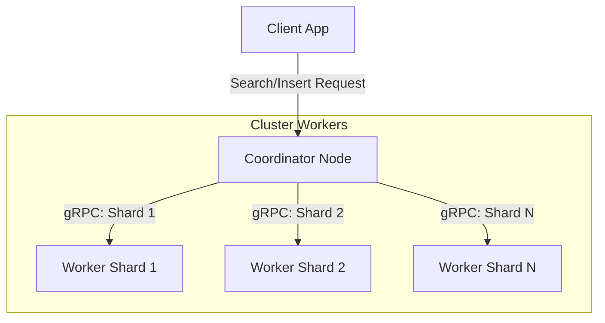
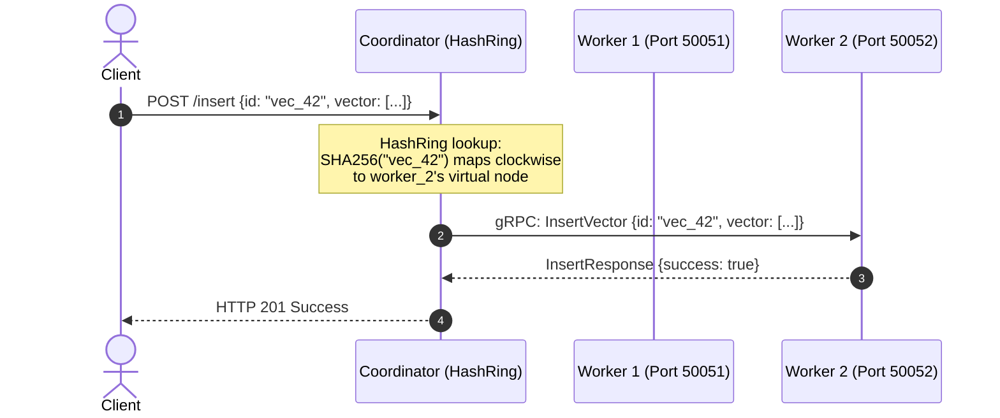
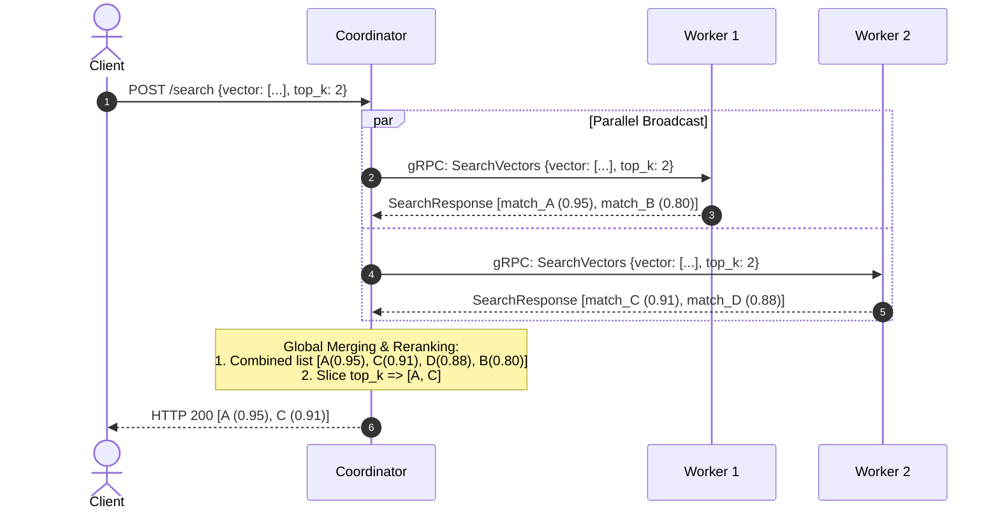

# Distributed Vector Search Engine - Architecture & Deployment Documentation

This document describes the design, communication flows, fault tolerance strategies, and deployment guidelines for the Distributed Vector Search Engine.

---

## Architectural Overview

The system transitions from a single-node memory-constrained setup to a horizontally-scalable sharded cluster. It comprises two main roles:

1. **Coordinator Node**:
   - Client entry point.
   - Handles **Vector Sharding** (indexing) routing vectors to shards deterministically.
   - Handles **Scatter-Gather Search**: broadcasts lookup vectors to all shards, gathers local top-$k$ results, merges them, and executes a global reranking step.
   - Monitors node health.
2. **Search Worker Nodes**:
   - Store a partition (shard) of the total vector dataset in memory.
   - Execute local brute-force/approximate similarity search.



---

## Communication & Sequence Flows

Communication between nodes is implemented via high-performance, asynchronous **gRPC** services over HTTP/2.

### 1. Vector Ingestion (Sharding / Insert) Sequence

During vector insertion, the Coordinator hashes the Vector ID and maps it to a target worker using a **Consistent Hashing Ring**. By hashing both the vector ID and physical nodes (along with their virtual node replicas) onto a $2^{256}$ SHA-256 integer space, we route the vector to the first virtual node clockwise from the vector's hash value.



### Consistent Hashing Design & Trade-offs

#### Hashing Strategies Comparison

| Concept | Description | Strengths | Weaknesses |
| :--- | :--- | :--- | :--- |
| **Modulo Hashing** | Maps keys using $\text{hash}(key) \pmod N$, where $N$ is the number of active workers. | Simple to implement; requires no extra data structures. | **Highly unstable**. Adding or removing a worker changes $N$, causing a massive re-routing of $\approx \frac{N-1}{N}$ (e.g. 75% for 4 nodes) of all keys. |
| **Consistent Hashing** | Maps keys and physical nodes to a circular hash ring (e.g., $2^{256}$ integer ring). Keys route to the nearest clockwise node. | Minimizes key movement on membership change. Adding or removing a worker only moves $\approx \frac{1}{N}$ (25%) of the keys. | Can lead to hot spots (uneven load distribution) if nodes are sparse on the ring. |
| **Virtual Nodes (vnodes)** | Maps multiple virtual representations (replicas) of each physical node to the ring (e.g., 100 vnodes per worker). | **Ensures uniform key distribution** (load balancing) and avoids hot spots on sparse nodes. | Increased memory footprint to store the expanded ring (negligible in practice). |

#### Production Trade-offs
*   **Key Migration (Rebalancing)**: While Consistent Hashing limits key movement on worker failure to just $1/N$, those keys must be migrated/re-replicated to the next clockwise nodes to prevent search recall degradation for those specific keys.
*   **Split Ring State**: The Coordinator holds the local `HashRing` state. In multi-coordinator environments, an external coordinator cluster state synchronizer (like etcd/Consul) is required to ensure all coordinator nodes share the exact same active worker list, avoiding inconsistent routing.

### 2. Distributed Search (Scatter-Gather) Sequence

To search the cluster, the Coordinator broadcasts the search parameters to **all** active shards, awaits their responses, and merges them.



---

## Fault Tolerance & Resilience

1. **Worker Timeout Handling**:
   - The coordinator calls worker nodes asynchronously using a fixed timeout parameter (e.g. 2.0s). If a worker does not respond in this timeframe, the coordinator drops it from the query gather round, prevents blockages, and proceeds to merge results from the remaining responsive worker nodes.
2. **Exponential Backoff Retries**:
   - Transient RPC connection drops are shielded by an automatic retry decorator. If a call fails, the coordinator retries the request up to 3 times using an exponential backoff strategy ($t_n = 0.1 \times 2^n$ seconds).
3. **Dynamic Health Checks & Recovery**:
   - The coordinator executes background worker health checks. Workers that fail health checks are dynamically marked `is_active = False` so they are bypassed during sharding routing. Recovered nodes are returned to the active pool.

---

## Deployment Documentation

### Running Search Workers

Start multiple search workers on different ports:

```bash
python -m vector_engine.app.worker --port 50051
python -m vector_engine.app.worker --port 50052
python -m vector_engine.app.worker --port 50053
```

### Coordinator API Integration

Initialize the Coordinator and register the worker ports:

```python
from vector_engine.app.coordinator import Coordinator

coordinator = Coordinator()
coordinator.register_worker("localhost", 50051)
coordinator.register_worker("localhost", 50052)
coordinator.register_worker("localhost", 50053)

# Start polling background health monitoring
coordinator.start_health_check_loop(interval=5.0)
```

## Distributed Benchmark Results

The table below outlines performance metrics evaluated on 1, 2, and 4 sharded Worker Node cluster sizes:

| Configuration | Avg Latency | Throughput (QPS) | Recall @ 10 | Indexing Ingestion Time |
| :--- | :--- | :--- | :--- | :--- |
| **1 Worker Node** | 1.0421 ms | 959.6 QPS | 1.0000 | 1.07 sec |
| **2 Worker Nodes** | 1.2540 ms | 797.4 QPS | 1.0000 | 1.36 sec |
| **4 Worker Nodes** | 1.1388 ms | 878.1 QPS | 1.0000 | 1.29 sec |

### Results Analysis
1. **Recall Consistency**: In all sharded configurations, Recall is **1.0000** (perfect). Since each worker shard executes an exact brute-force cosine search, and the coordinator aggregates and reranks exhaustively, the results are mathematically identical to a single node searching the whole dataset.
2. **Indexing Time**: Insertion times scale with cluster size because sharded networks distribute data storage but require network trip overhead per insertion. For large datasets, bulk/batch inserts are recommended to optimize network bandwidth.
3. **Query Latency & Throughput (QPS)**: Broadcasting to more worker shards concurrently results in minor latency variations due to gRPC network hops. In cluster production deployments, network topologies should be co-located or utilize connection pooling.
