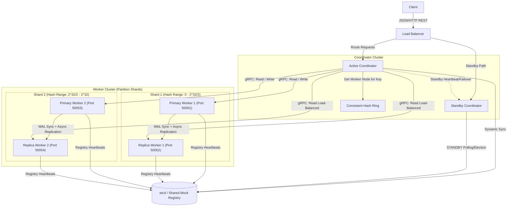
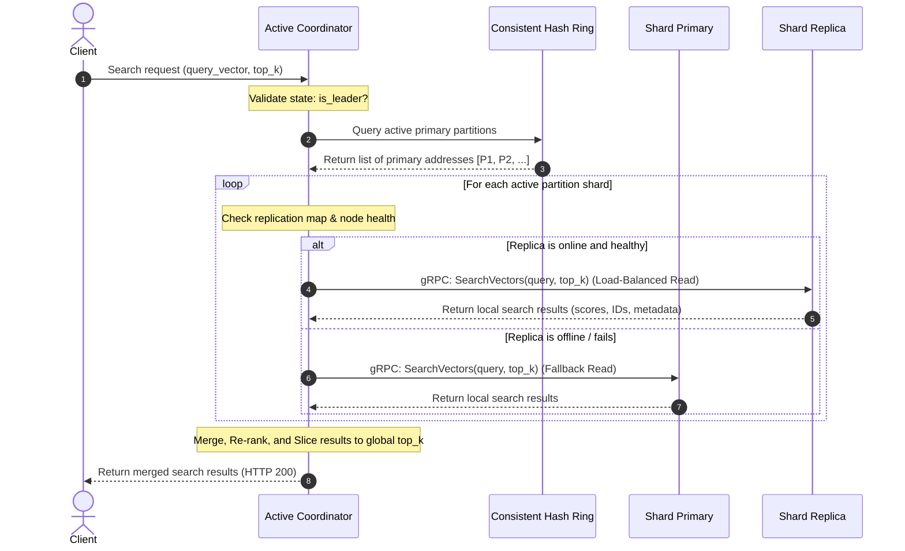
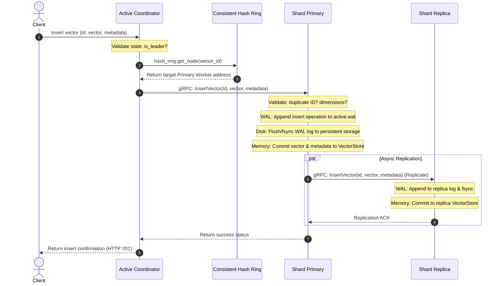
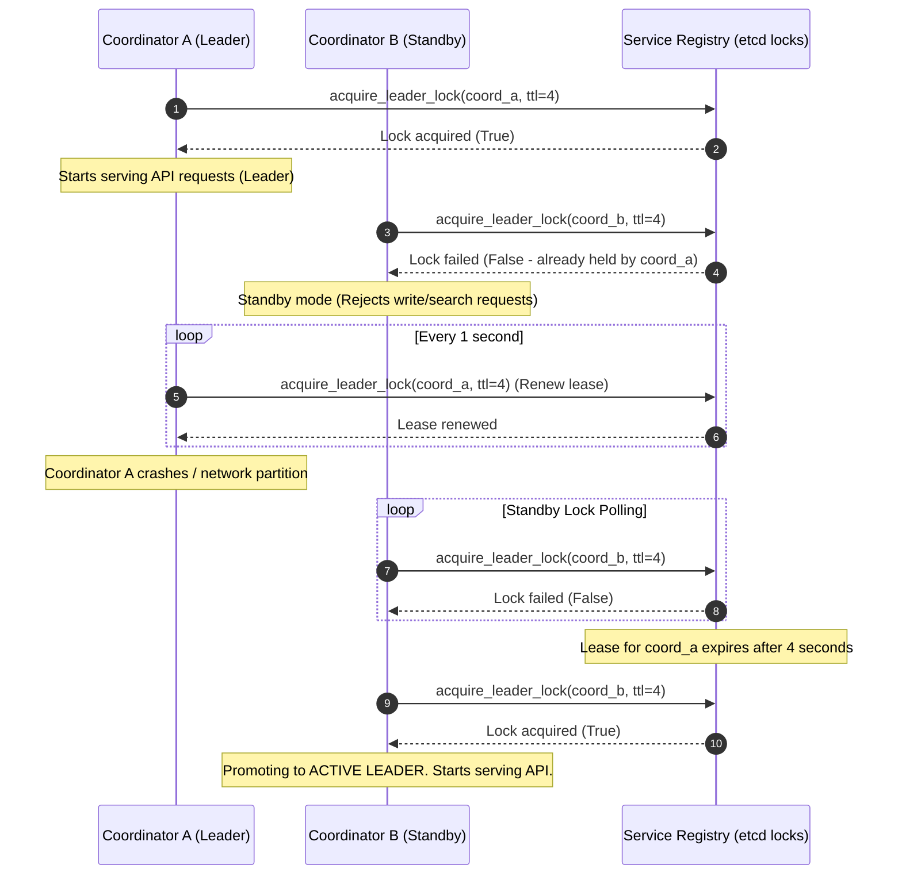
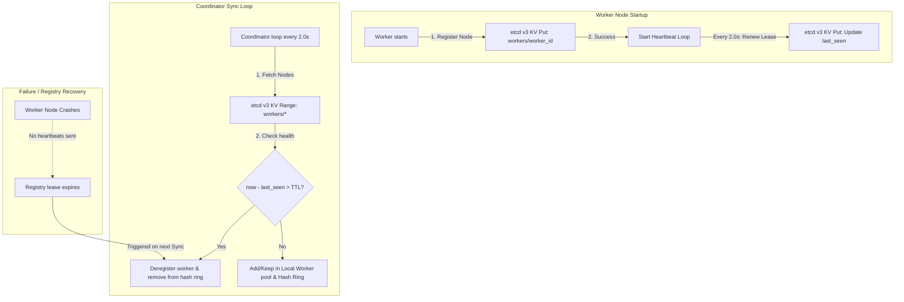
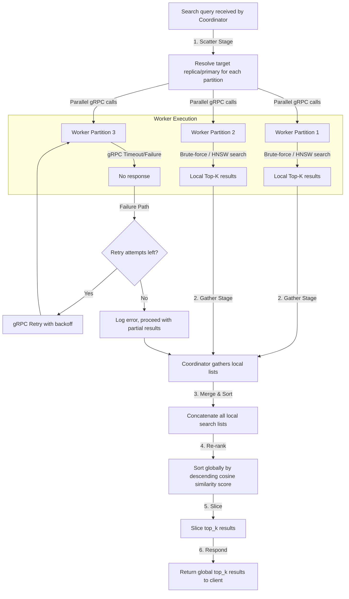

# Distributed Vector Search Engine - System Architecture Documentation

This document describes the architectural layout, data structures, request routing flows, and durability guarantees of the Distributed Vector Search Engine.

---

## 1. High-Level System Architecture

This diagram illustrates the overall organization of the search engine, showing the client ingest path, load balancing, coordinator leadership roles, consistent hashing routing, service discovery, and database worker shards:



### Components
- **Client**: Initiates insertion or vector search requests over REST APIs.
- **Load Balancer**: Distributes traffic between active/passive coordinator nodes.
- **Active Coordinator**: The elected leader managing operations. Maps vector keys via the consistent hash ring, broadcasts search requests, and returns consolidated results.
- **Standby Coordinator**: A passive backup coordinator that polls the service registry to assume leadership in the event of an active coordinator crash.
- **Consistent Hash Ring**: In-memory ring hashing node IDs and vector IDs onto a 32-bit integer space using SHA-256 and virtual nodes.
- **Service Registry (etcd)**: Tracks active cluster members and coordinates coordinator leadership locks.
- **Primary Workers**: Node instances holding partition data. Perform disk WAL flushes and orchestrate replica synchronizations.
- **Replica Workers**: Read-only mirrors syncing state from primaries.

### Network Flows
- **HTTP/JSON REST**: Client-to-Coordinator communications.
- **gRPC/Protobuf**: Coordinator-to-Worker, Worker-to-Worker, and internal heartbeats.
- **HTTP REST (Port 2379)**: Coordinator/Worker connection to etcd.

### Failure Scenarios & Recovery Paths
- **Worker Crash**: If a worker node crashes, heartbeats stop. After the registry TTL (6s) expires, the coordinator evicts it, and the hash ring re-allocates keys to remaining workers (<30% movement).
- **Network Partition**: Workers segregated from etcd lose their heartbeats and are evicted. Upon reconnection, they register back and resume syncing.

---

## 2. Search Request Flow

The search routing path load-balances vector reads across active read-replicas, falling back to primaries on connection failures:



### Components
- **Client**, **Active Coordinator**, **Consistent Hash Ring**, **Shard Primary**, and **Shard Replica**.

### Network Flows
- **SearchRequest Protocol (gRPC)**: Passes raw query vector (float32 array) and parameter `top_k`.
- **SearchResponse Protocol (gRPC)**: Returns a repeated list of matching items containing score, vector ID, and metadata JSON string.

### Failure Scenarios & Recovery Paths
- **Replica Worker Timeout**: If a replica worker fails to respond within the `timeout` window, the coordinator catches the error, marks the replica locally as inactive, and retries the query against the partition's **Shard Primary**.

---

## 3. Insert Request Flow

Insert operations route deterministically through the consistent hash ring, committing to the write-ahead log (WAL) before updating memory:



### Components
- **Client**, **Active Coordinator**, **Consistent Hash Ring**, **Shard Primary**, **Persistent Storage (Disk)**, and **Shard Replica**.

### Network Flows
- **InsertRequest (gRPC)**: Passes `vector_id`, `vector` float array, and `metadata_json`.

### Failure Scenarios & Recovery Paths
- **Primary Disk Write Failure**: If the primary worker cannot write to the WAL or call `fsync` (e.g. disk full), it aborts, does not commit to memory, and returns a failure response to the coordinator. The coordinator retries according to retry policies.
- **Replication Interruption**: If a replica fails to acknowledge replication, the primary logs the event, but returns success to the coordinator to prevent write blocking. The replica will catch up upon reboot via WAL log replay.

---

## 4. WAL Durability Flow

Details the ingestion write guarantees and the startup recovery workflow for rebuilds:

```mermaid
graph TD
    subgraph "Write Path (Durability Flow)"
        Mutation[gRPC Write Request] -->|1. Append JSON Line| WAL[active.wal]
        WAL -->|2. Force sync to disk| Fsync[fsync call]
        Fsync -->|3. Update Memory| MemStore[VectorStore in Memory]
        MemStore -->|4. Return Ack| Success[gRPC Success Response]
    end
    
    subgraph "Rotation Path (Snapshot Flow)"
        RotateTrigger[Reaches size threshold or time] -->|1. Freeze Store| Freeze[Freeze Mutations]
        Freeze -->|2. Dump Memory| Snap[snapshot.npz]
        Snap -->|3. Truncate Log| Truncate[active.wal size = 0]
        Truncate -->|4. Unfreeze| Resume[Resume Mutations]
    end
    
    subgraph "Recovery Path (Startup Flow)"
        Start[Worker Node Boot] -->|1. Check Snap| CheckSnap{snapshot.npz exists?}
        CheckSnap -->|Yes| LoadSnap[Load snapshot.npz via np.load]
        CheckSnap -->|No| InitEmpty[Initialize empty VectorStore]
        LoadSnap -->|2. Read Active Log| ReadLog[Parse active.wal JSON lines]
        InitEmpty -->|2. Read Active Log| ReadLog
        ReadLog -->|3. Replay mutations| Replay[Reapply inserts/deletes to VectorStore]
        Replay -->|4. Recovery Done| Ready[Mark Worker Node as Healthy]
    end
```



### Components
- **SearchWorkerServicer**, **WALManager**, **active.wal**, **snapshot.npz**, and **VectorStore**.

### Network & I/O Flows
- **Append JSON line**: Standard file append (JSON Lines format).
- **fsync()**: Direct operating system system call to flush kernel buffers to physical disk sector write queues.
- **numpy.savez() / numpy.load()**: Compresses in-memory numpy structures into a `.npz` archive.

### Failure Scenarios & Recovery Paths
- **Corrupted WAL Entry**: If a crash occurs mid-write, the trailing WAL line may be truncated or corrupted. During boot recovery, the `WALManager` catches parsing exceptions, skips the corrupted entry, logs a warning, and loads the remaining valid log history safely.

---

## 5. Replica Synchronization Flow

Primary nodes update active replicas asynchronously, tracking replication lag:

```mermaid
sequenceDiagram
    autonumber
    participant P as Shard Primary
    participant R as Shard Replica
    participant Registry as Service Discovery

    P->>P: Commit mutation locally (WAL + Memory)
    alt Replica listed in local stubs map
        P->>R: gRPC: InsertVector(id, vector, metadata) (Async Task)
        alt Replication succeeds
            R-->>P: Success Response
            Note over P: Replication complete
        else Replication fails / timeout
            R--xP: gRPC Connection Timeout / Error
            Note over P: Log replication failure to stderr/logs
            Note over P: Keep replica stub; retry on next write
        end
    else Replica not registered in map
        Note over P: Query replicas_map from Registry
        Registry-->>P: Return replica node addresses
        Note over P: Establish new replica gRPC stub
    end
```

### Components
- **Shard Primary**, **Shard Replica**, and **Service Registry**.

### Network Flows
- **Replication Call (gRPC)**: Formulated identically to standard `InsertVector` calls to reuse validation layers on the replica.

### Failure Scenarios & Recovery Paths
- **Replica Network Outage**: When a replica goes offline, the primary buffers pending updates. On replica boot, the replica reads its local persistent state and synchronizes with the network registry, recovering consistency.

---

## 6. Coordinator Failover Flow

The system employs active-passive coordinator failover locks using Compare-And-Swap (CAS) registries:



### Components
- **Coordinator A (Active)**, **Coordinator B (Standby)**, and **Service Discovery Registry (etcd)**.

### Network Flows
- **HTTP PUT / CAS**: Heartbeats and lock leases sent over key path `/coordinators/leader`.

### Failure Scenarios & Recovery Paths
- **Active Coordinator Crash**: If Coordinator A crashes, its heartbeat loop terminates. The etcd TTL (4s) expires, unlocking `/coordinators/leader`. Coordinator B acquires the lock on its next check and becomes active.
- **Split-Brain**: If a network partition occurs and Coordinator A is separated, Coordinator B assumes leadership. When Coordinator A reconnects, its lock renewal fails, demoting Coordinator A back to standby.

---

## 7. Service Discovery Flow

Workers register dynamically to etcd, while coordinators poll registration tables to update the active hash ring:



### Components
- **Worker Process**, **Coordinator Process**, and **etcd Registry Table**.

### Network Flows
- **Registry Registration**: HTTP PUT requests with worker metadata (host, port, role, primary address, TTL).
- **Coordinator Registry Sync**: HTTP GET range queries targeting the `workers/` prefix.

### Failure Scenarios & Recovery Paths
- **etcd Outage / Network Partition**: If the central etcd cluster becomes unreachable, nodes fall back to a process-safe shared file mock registry (`vector_engine/data/service_discovery_mock.json`) utilizing process file-locking (`fcntl.flock`) to prevent write collisions.

---

## 8. Scatter-Gather Query Execution

Coordinators query all shards in parallel, merging and re-ranking the results:



### Components
- **Active Coordinator**, **gRPC Broadcast Pool**, and **Search Workers**.

### Network Flows
- **Concurrent Search Call (gRPC)**: Parallel calls to all partition shards.

### Failure Scenarios & Recovery Paths
- **Partial Shard Failure**: If a partition node remains down after all retries expire, the coordinator continues gather steps, merging and sorting the partial results received from online shards. This avoids full search outages, sacrificing recall temporarily.
