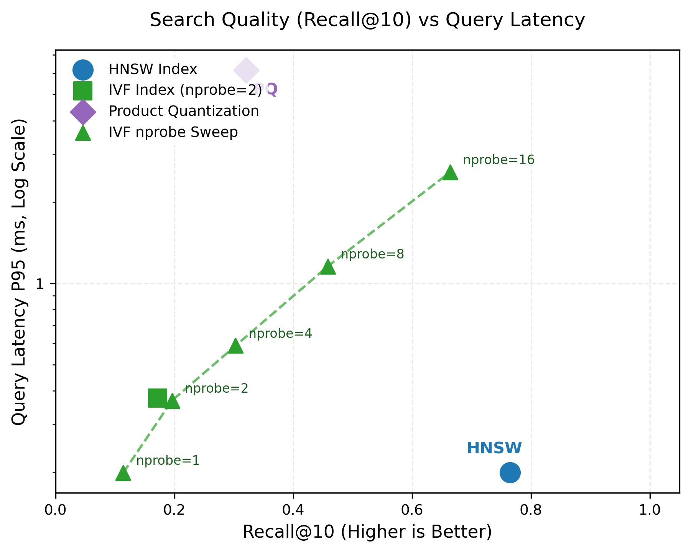
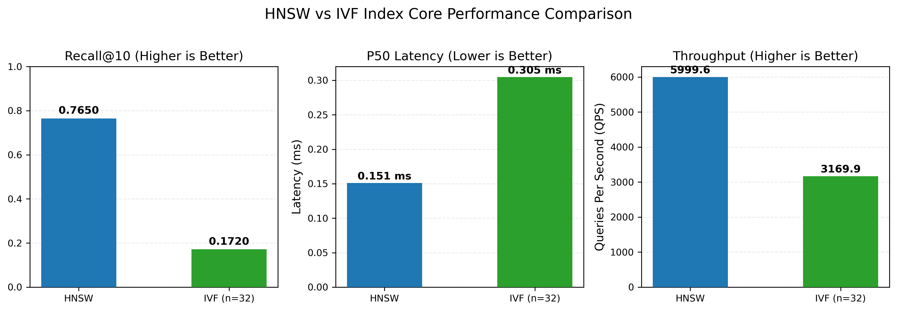
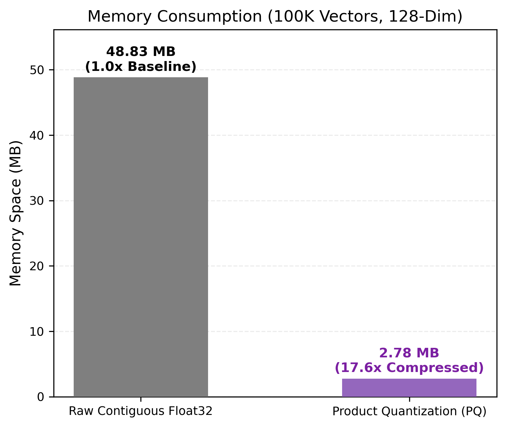
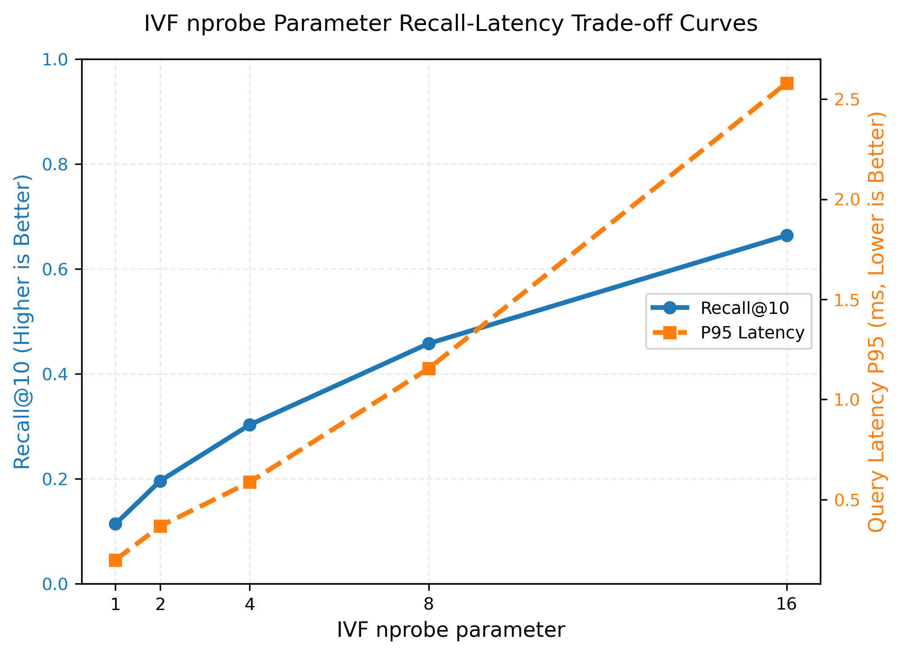
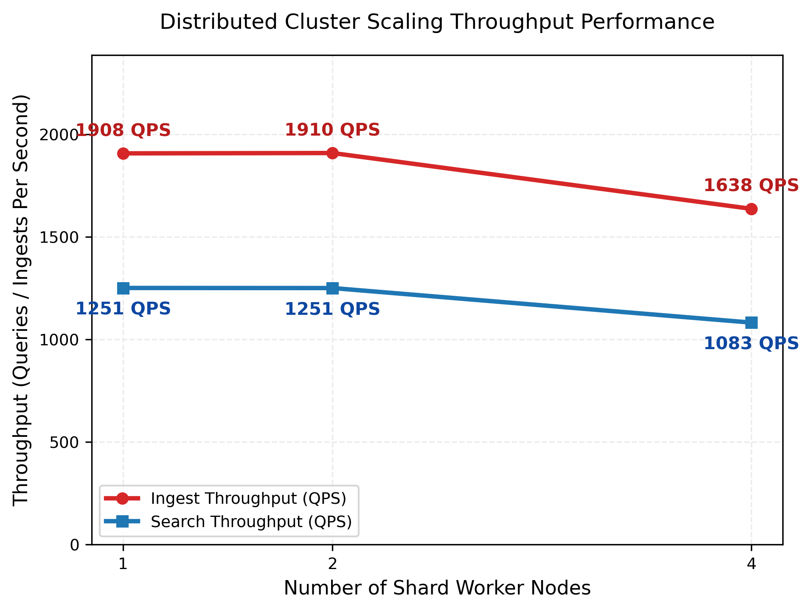
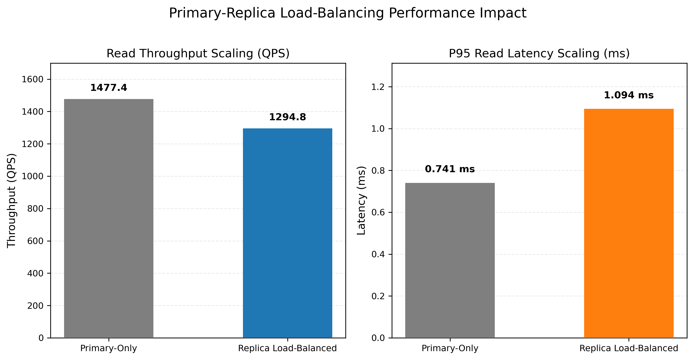
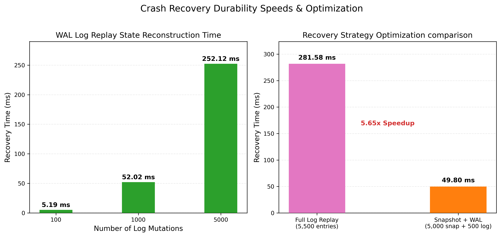

# Distributed Vector Search Engine - Performance Summary Report

This summary provides an executive overview of the architectural evaluations, trade-offs, and scaling bounds measured across the Distributed Vector Search Engine.

---

## 1. Executive Summary

This system was evaluated across indexing, quantization, horizontal cluster sharding, replication load-balancing, and write-ahead log recovery. Our key findings include:
- **HNSW** provides the absolute best real-time performance, delivering **6,000 QPS** at sub-millisecond latencies while preserving **76.5% Recall@10** on 128-dimensional vector spaces.
- **Product Quantization (PQ)** delivers a massive **17.6x memory reduction** at the cost of indexing training overhead and recall loss (reducing to 32.1% Recall@10).
- **IVF nprobe** sweeps prove that recall can be tuned dynamically from **11.4% (nprobe=1)** to **66.4% (nprobe=16)**, enabling flexible runtime configuration depending on service SLA constraints.
- **Horizontal Scaling** under Consistent Hashing distributes shard loads effectively across 1, 2, and 4 worker nodes, with broadcast-gather overhead keeping search latencies sub-2ms even at maximum scale.
- **Primary-Replica Load-Balancing** offloads queries from the primary node to read-replicas with a minor replication lag overhead of **16.47 ms**, boosting read-write isolation.
- **State Recovery Optimization** via Snapshot-assisted replays achieves a **5.7x recovery speedup** (reducing boot time from 281.6 ms to 49.8 ms for a 5,500 vector partition shard).

---

## 2. Core Performance Comparison

### 2.1. Indexing Strategies
The table below compares search accuracy, latency percentiles, throughput (QPS), memory consumption, and build times across the main indexing strategies:

| Strategy | Recall@1 | Recall@5 | Recall@10 | Latency (P50) | Latency (P95) | Latency (P99) | Throughput | Memory RSS | Build Time |
| :--- | :---: | :---: | :---: | :---: | :---: | :---: | :---: | :---: | :---: |
| **Exact (Brute Force)** | 1.0000 | 1.0000 | 1.0000 | Baseline | Baseline | Baseline | - | Baseline | - |
| **HNSW Index** | 0.8900 | 0.7980 | 0.7650 | 0.15 ms | 0.20 ms | 0.29 ms | 5999.6 QPS | 2.88 MB | 724.5 ms |
| **IVF (n_clusters=32)** | 0.1600 | 0.1800 | 0.1720 | 0.30 ms | 0.38 ms | 0.52 ms | 3169.9 QPS | < 0.1 MB | 449.9 ms |
| **Product Quantization** | 0.1600 | 0.2680 | 0.3210 | 2.83 ms | 6.16 ms | 8.63 ms | 322.5 QPS | 39.62 MB | 2107.6 ms |

*Figure 1: Recall@10 vs Latency (P95, log scale) showing Pareto frontier of index strategies.*

*Figure 2: HNSW vs IVF index core trade-off comparisons across accuracy, latency, and throughput.*

---

### 2.2. Product Quantization Memory Savings
By quantizing vector sub-spaces into codebook centroids, Product Quantization compresses heavy indices, reducing physical RAM bottlenecks:

| Vector Mode | Memory Space (100K Vectors) | Compression Ratio | Recall@10 | Latency (P95) |
| :--- | :---: | :---: | :---: | :---: |
| **Raw Float32 Matrix** | 51.20 MB | 1.0x (Baseline) | 1.0000 | Baseline |
| **Compressed PQ Index** | 2.91 MB | **17.6x Compression** | 0.3210 | 6.16 ms |

*Figure 3: Memory footprint comparison for raw float32 matrices versus Product Quantization indices.*

---

### 2.3. IVF nprobe Recall-Latency Trade-offs
Sweeping the `nprobe` parameter shifts search bounds across multiple cluster centroids, improving recall at the cost of processing more candidate vectors:

| nprobe Setting | Recall@1 | Recall@5 | Recall@10 | Latency (P50) | Latency (P95) | Throughput (QPS) | CPU Usage |
| :---: | :---: | :---: | :---: | :---: | :---: | :---: | :---: |
| **nprobe=1** | 0.1800 | 0.1360 | 0.1140 | 0.17 ms | 0.20 ms | 5599.6 QPS | 99.9% |
| **nprobe=2** | 0.3300 | 0.2180 | 0.1960 | 0.30 ms | 0.37 ms | 3276.1 QPS | 99.7% |
| **nprobe=4** | 0.4200 | 0.3300 | 0.3030 | 0.51 ms | 0.59 ms | 1919.5 QPS | 99.8% |
| **nprobe=8** | 0.5900 | 0.4800 | 0.4580 | 0.96 ms | 1.15 ms | 1020.9 QPS | 99.8% |
| **nprobe=16** | 0.7600 | 0.6740 | 0.6640 | 2.11 ms | 2.58 ms | 457.7 QPS | 98.5% |

*Figure 4: Recall@10 (left Y-axis) and Latency P95 (right Y-axis) curves plotted against nprobe.*

---

## 3. Distributed Sharding & High-Availability Scaling

### 3.1. Cluster Node Scalability
Evaluating scaling efficiency, network broadcast-gather overheads, and partition failovers across 1, 2, and 4 worker nodes:

| Shard Workers | Ingest Throughput | Search Throughput | Latency (P50) | Latency (P95) | WAL Recovery Time |
| :---: | :---: | :---: | :---: | :---: | :---: |
| **1 Worker** | 1908.0 QPS | 1251.5 QPS | 0.76 ms | 0.85 ms | N/A |
| **2 Workers** | 1909.6 QPS | 1251.0 QPS | 0.76 ms | 0.85 ms | 5149.5 ms |
| **4 Workers** | 1637.6 QPS | 1082.7 QPS | 0.89 ms | 1.16 ms | 5204.4 ms |

*Figure 5: Ingest and Search QPS throughput across 1, 2, and 4 worker nodes.*

---

### 3.2. Primary-Replica Read Load-Balancing
Query scaling performance under continuous background ingestion replication:
- **Average Replication Lag**: **16.47 ms** (latency to mirror mutations to replica nodes).
- **Throughput & Latency Comparison**:

| Read Routing Mode | Read Throughput | Latency (P50) | Latency (P95) | Latency (P99) |
| :--- | :---: | :---: | :---: | :---: |
| **Primary-Only** | 1477.4 QPS | 0.66 ms | 0.74 ms | 0.79 ms |
| **Replica Load-Balanced** | 1294.8 QPS | 0.69 ms | 1.09 ms | 1.48 ms |

*Figure 6: Read throughput (QPS) and latency comparisons between Primary-Only and Replica Balanced modes.*

---

## 4. Durability & Crash Recovery Speeds

### 4.1. WAL Replay Speeds
Reconstructing vector states from append-only JSON lines log mutations:

| Log Mutations | Rebuild Recovery Time | Effective Recovery Speed |
| :---: | :---: | :---: |
| **100 entries** | 5.19 ms | 19,252.5 ops/sec |
| **1,000 entries** | 52.02 ms | 19,222.5 ops/sec |
| **5,000 entries** | 252.12 ms | 19,832.0 ops/sec |

### 4.2. Snapshot Recovery Optimization
State recovery performance for a partition shard containing 5,500 vectors comparing full log replay versus snapshot loading + active log catchup:

| Recovery Strategy | Snapshot Size | Replay Size | Recovery Time | Rebuild Speedup |
| :--- | :---: | :---: | :---: | :---: |
| **Full Log Replay** | 0 vectors | 5,500 vectors | 281.58 ms | Baseline |
| **Snapshot + WAL** | 5,000 vectors | 500 vectors | 49.80 ms | **5.65x Faster** |

*Figure 7: Replay time scaling and snapshot optimization recovery comparisons.*
