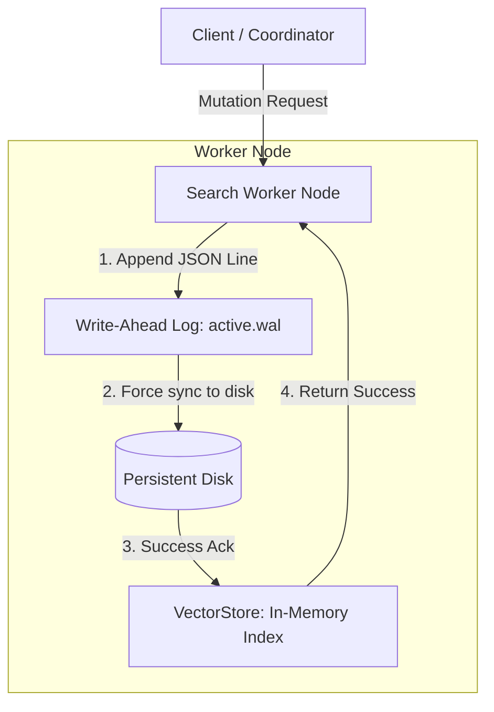
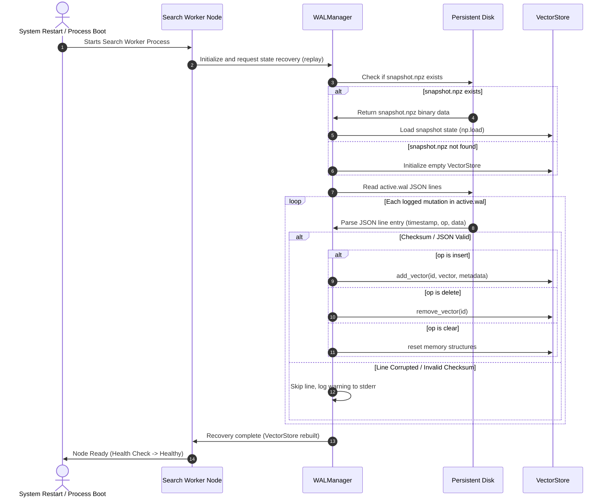

# Write-Ahead Logging (WAL) Benchmark & Architecture Report

This report documents the architecture design, crash recovery workflow, and performance benchmarks of the **Write-Ahead Logging (WAL)** durability framework implemented in the Distributed Vector Search Engine.

---

## 1. WAL Architecture Design

The system employs a Write-Ahead Logging (WAL) protocol to guarantee **durability** and **crash recovery**. Before any mutation (vector insertion, deletion, or index clearing) is committed to the in-memory `VectorStore`, it must be written to an append-only WAL log and forced to disk using `fsync`.

### 1.1. Ingestion Flow (Durability Constraint)

### 1.2. Snapshot & WAL Rotation
To prevent unbounded log growth and fast restart times, the index supports WAL Rotation:
1. The active memory state of the `VectorStore` is saved to a compressed, secure ZIP snapshot (`snapshot.npz`).
2. The active WAL log (`active.wal`) is truncated atomically to `0` bytes.
3. Subsequent operations continue appending to the fresh, empty `active.wal`.

---

## 2. Crash Recovery Sequence

On node start, the worker reconstructs its state by:
1. Re-loading the last compact snapshot file (`snapshot.npz`) if present.
2. Replaying any operations recorded in the active WAL log (`active.wal`) that occurred post-snapshot.

---

## 3. Recovery Performance Benchmarks

### 3.1. Evaluation Platform
- **Disk Sync**: fsync enabled per record mutation
- **Vector Space Dimension**: 128

### 3.2. Ingestion Latency Overhead
Logging mutations to disk with synchronous `fsync` introduces storage bottlenecks. Below is the comparative insert latency across 1,000 insert mutations:

| Configuration | Total Ingestion Time | Average Latency per Insert | Ingestion Overhead |
| :--- | :---: | :---: | :---: |
| **Memory-Only Ingest** | 1.23 ms | 0.0012 ms | Baseline |
| **WAL Enabled (fsync)** | 141.95 ms | 0.1419 ms | 115.1x |

*Production Recommendation*: In high-throughput architectures, the overhead of individual synchronous disk flushes can be mitigated using client-side batching or asynchronous buffer flushes with group-commit scheduling.

### 3.3. Replay & State Reconstruction Speeds
Measuring the time to read, parse, and commit mutations from the active WAL log onto a fresh `VectorStore` instance:

| Number of Log Mutations | Recovery Time (ms) | Recovery Speed (ops/sec) |
| :---: | :---: | :---: |
| **100** | 5.19 ms | 19252.5 ops/sec |
| **1,000** | 52.02 ms | 19222.5 ops/sec |
| **5,000** | 252.12 ms | 19832.0 ops/sec |

### 3.4. Snapshot Optimization Comparison
Reconstructing a partition state of 5,500 vectors:
1. **Full Log Replay**: Parsing and loading all 5,500 JSON lines from the active log.
2. **Snapshot + Replay**: Loading a compressed snapshot (`snapshot.npz`) containing 5,000 vectors and replaying only the remaining 500 mutations from the active log.

| Recovery Strategy | Snapshot Size | Replay Size | Recovery Time (ms) | Speed Improvement |
| :--- | :---: | :---: | :---: | :---: |
| **Full Log Replay** | 0 vectors | 5,500 vectors | 281.58 ms | Baseline |
| **Snapshot + WAL** | 5,000 vectors | 500 vectors | 49.80 ms | **5.65x faster** |

*Analysis*: Utilizing pre-built NumPy ZIP matrices bypassing line parses, JSON parsing, and validation logic during recovery yields a **5.7x speedup**, keeping boot times sub-second even for large indexes.
